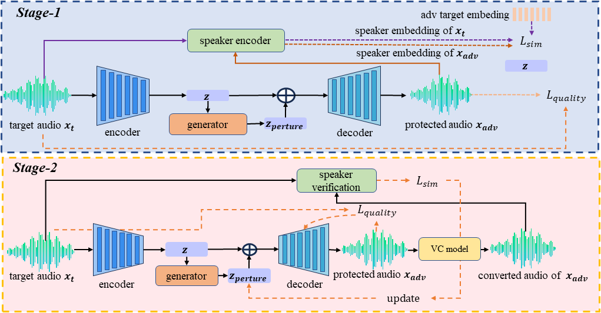

# Abstract
Voice Conversion (VC) technologies have advanced significantly, enabling voice cloning with just a few seconds of audio, posing serious risks to privacy, property, and reputation. In response to these threats, adversarial defense methods protect users by adding imperceptible perturbations to the audio, making it harder for VC models to clone the original voice. However, current methods are effective in white-box scenarios but struggle in black-box settings where VC models' internal parameters and structures are unknown. To address this problem, we propose a black-box adversarial defense method that effectively adapts and defends against unknown VC models relies solely on black-box feedback. We introduce a latent perturbation model that compresses speech and generates initial perturbations to reduce the search space and ensure convergence for black-box optimization. We then apply evolution-based black-box optimization to refine the perturbations, improving defense performance against unknown VC models. Extensive experiments on state-of-the-art VC models demonstrate the adaptability and superior defense performance of our method in real-world black-box scenarios compared to other defence approaches.

    

## Defense against QuickVC

This is a normal paragraph following a header. GitHub is a code hosting platform for version control and collaboration. It lets you and others work together on projects from anywhere.

<table style="width: 100%; border-collapse: collapse;">
    <tr>
      <td></td>
      <th colspan="2" style="text-align: center;">Content utterance</th>
    </tr>
    <tr>
      <td style="text-align: center;"><i>p225_002</i></td>
      <td colspan="2" style="text-align: center;">
        <audio src="audio/chou/pair-085/content.wav" controls preload></audio>
      </td>
    </tr>
    <tr>
      <td></td>
      <th style="text-align: center;">Speaker utterance</th>
      <th style="text-align: center;">Conversion result</th>
    </tr>
    <tr>
      <td style="text-align: center;">
        <i>p333_334</i>
         
        Our
      </td>
      <td style="text-align: center;">
        <audio src="audio/pertured_black_box_QuickVC/p225_002_p230_269.wav" controls preload></audio>
      </td>
      <td style="text-align: center;">
        <audio src="audio/black_box_QuickVC_test_antifakeloss/p225_002_p230_269.wav" controls preload></audio>
      </td>
    </tr>
    <tr>
      <td style="text-align: center;">
        <i>p333_334</i>
         
        Antifake
      </td>
      <td style="text-align: center;">
        <audio src="audio/perture_antifake/p225_002_p230_269.wav" controls preload></audio>
      </td>
      <td style="text-align: center;">
        <audio src="audio/antifake2QuickVC/p225_002_p230_269.wav" controls preload></audio>
      </td>
    </tr>
        <tr>
      <td style="text-align: center;">
        <i>p333_334</i>
         
        Attack-VC
      </td>
      <td style="text-align: center;">
        <audio src="audio/pertured_attackvc/p225_002_p230_269.wav" controls preload></audio>
      </td>
      <td style="text-align: center;">
        <audio src="audio/attack2QuickVC/p225_002_p230_269.wav" controls preload></audio>
      </td>
    </tr>
    </tr>
        <tr>
      <td style="text-align: center;">
        <i>p333_334</i>
         
        VoiceGuard
      </td>
      <td style="text-align: center;">
        <audio src="audio/pertured_voiceguard/p225_002_p230_269.wav" controls preload></audio>
      </td>
      <td style="text-align: center;">
        <audio src="audio/voiceguard2QuickVC/p225_002_p230_269.wav" controls preload></audio>
      </td>
    </tr>
    </tr>
        <tr>
      <td style="text-align: center;">
        <i>p333_334</i>
         
        Our(stage-1)
      </td>
      <td style="text-align: center;">
        <audio src="audio/pertured_gen_once/p225_002_p230_269.wav" controls preload></audio>
      </td>
      <td style="text-align: center;">
        <audio src="audio/gen_once2QuickVC/p225_002_p230_269.wav" controls preload></audio>
      </td>
    </tr>
  </table>

## Defense against TriAANVC

<table style="width: 100%; border-collapse: collapse;">
    <tr>
      <td></td>
      <th colspan="2" style="text-align: center;">Content utterance</th>
    </tr>
    <tr>
      <td style="text-align: center;"><i>p225_002</i></td>
      <td colspan="2" style="text-align: center;">
        <audio src="audio/chou/pair-085/content.wav" controls preload></audio>
      </td>
    </tr>
    <tr>
      <td></td>
      <th style="text-align: center;">Speaker utterance</th>
      <th style="text-align: center;">Conversion result</th>
    </tr>
    <tr>
      <td style="text-align: center;">
        <i>p333_334</i>
         
        Our
      </td>
      <td style="text-align: center;">
        <audio src="audio/pertured_black_box_TriAANVC/p225_002_p330_213.wav" controls preload></audio>
      </td>
      <td style="text-align: center;">
        <audio src="audio/black_box_TriAANVC_test_antifakeloss/p225_002_p330_213.wav" controls preload></audio>
      </td>
    </tr>
    <tr>
      <td style="text-align: center;">
        <i>p333_334</i>
         
        Antifake
      </td>
      <td style="text-align: center;">
        <audio src="audio/perture_antifake/p225_002_p330_213.wav" controls preload></audio>
      </td>
      <td style="text-align: center;">
        <audio src="audio/antifake2TriAANVC/p225_002_p330_213.wav" controls preload></audio>
      </td>
    </tr>
    </tr>
        <tr>
      <td style="text-align: center;">
        <i>p333_334</i>
         
        Attack-VC
      </td>
      <td style="text-align: center;">
        <audio src="audio/pertured_attackvc/p225_002_p330_213.wav" controls preload></audio>
      </td>
      <td style="text-align: center;">
        <audio src="audio/attack2TriAANVC/p225_002_p330_213.wav" controls preload></audio>
      </td>
    </tr>
    </tr>
        <tr>
      <td style="text-align: center;">
        <i>p333_334</i>
         
        VoiceGuard
      </td>
      <td style="text-align: center;">
        <audio src="audio/pertured_voiceguard/p225_002_p330_213.wav" controls preload></audio>
      </td>
      <td style="text-align: center;">
        <audio src="audio/voiceguard2TriAANVC/p225_002_p330_213.wav" controls preload></audio>
      </td>
    </tr>
    </tr>
        <tr>
      <td style="text-align: center;">
        <i>p333_334</i>
         
        Our(stage-1)
      </td>
      <td style="text-align: center;">
        <audio src="audio/pertured_gen_once/p225_002_p330_213.wav" controls preload></audio>
      </td>
      <td style="text-align: center;">
        <audio src="audio/gen_once2TriAANVC/p225_002_p330_213.wav" controls preload></audio>
      </td>
    </tr>
  </table>

## Defense against FreeVC

<table style="width: 100%; border-collapse: collapse;">
    <tr>
      <td></td>
      <th colspan="2" style="text-align: center;">Content utterance</th>
    </tr>
    <tr>
      <td style="text-align: center;"><i>p225_002</i></td>
      <td colspan="2" style="text-align: center;">
        <audio src="audio/chou/pair-085/content.wav" controls preload></audio>
      </td>
    </tr>
    <tr>
      <td></td>
      <th style="text-align: center;">Speaker utterance</th>
      <th style="text-align: center;">Conversion result</th>
    </tr>
    <tr>
      <td style="text-align: center;">
        <i>p333_334</i>
         
        Our
      </td>
      <td style="text-align: center;">
        <audio src="audio/pertured_black_box-FreeVC/p225_002_p234_017.wav" controls preload></audio>
      </td>
      <td style="text-align: center;">
        <audio src="audio/black_box_FreeVC_test_antifakeloss/p225_002_p234_017.wav" controls preload></audio>
      </td>
    </tr>
    <tr>
      <td style="text-align: center;">
        <i>p333_334</i>
         
        Antifake
      </td>
      <td style="text-align: center;">
        <audio src="audio/perture_antifake/p225_002_p234_017.wav" controls preload></audio>
      </td>
      <td style="text-align: center;">
        <audio src="audio/antifake2FreeVC/p225_002_p234_017.wav" controls preload></audio>
      </td>
    </tr>
    </tr>
        <tr>
      <td style="text-align: center;">
        <i>p333_334</i>
         
        Attack-VC
      </td>
      <td style="text-align: center;">
        <audio src="audio/pertured_attackvc/p225_002_p234_017.wav" controls preload></audio>
      </td>
      <td style="text-align: center;">
        <audio src="audio/attack2FreeVC/p225_002_p234_017.wav" controls preload></audio>
      </td>
    </tr>
    </tr>
        <tr>
      <td style="text-align: center;">
        <i>p333_334</i>
         
        VoiceGuard
      </td>
      <td style="text-align: center;">
        <audio src="audio/pertured_voiceguard/p225_002_p234_017.wav" controls preload></audio>
      </td>
      <td style="text-align: center;">
        <audio src="audio/voiceguard2FreeVC/p225_002_p234_017.wav" controls preload></audio>
      </td>
    </tr>
    </tr>
        <tr>
      <td style="text-align: center;">
        <i>p333_334</i>
         
        Our(stage-1)
      </td>
      <td style="text-align: center;">
        <audio src="audio/pertured_gen_once/p225_002_p234_017.wav" controls preload></audio>
      </td>
      <td style="text-align: center;">
        <audio src="audio/gen_once2FreeVC/p225_002_p234_017.wav" controls preload></audio>
      </td>
    </tr>
  </table>

